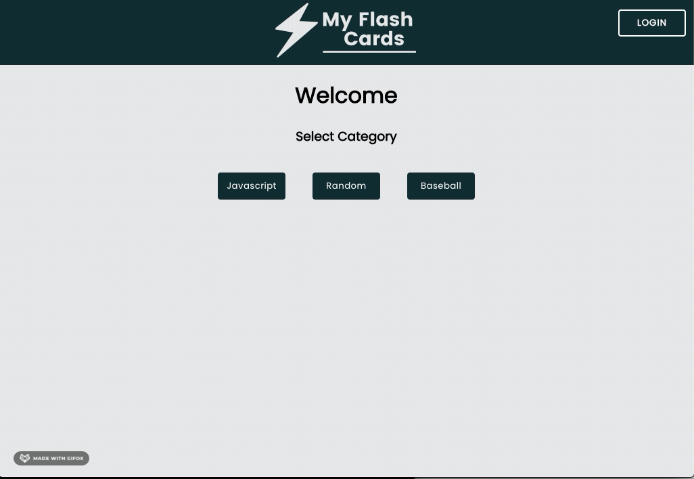

# My Flash Cards

React App that uses flash cards to help you study.

## Description

Allows a user to access categories of flash cards to learn and study topics that have already been added. The app also allows users to add categories and cards for themselves to use or others to use.

## Motivation

I created this app in hopes that I would be able to learn more about certain programming topics while populating the database.

## Challenges and Solutions

-   Deploying both the front-end and back-end for demo purposes:
    -   I used Netlify to deploy the front-end and Heroku to deploy the API
-   One of the goals of this project was to create at least one test for the project:
    -   Testing is something that I started out having a hard time with, but I really want to become more knowledgable with testing. I was able to get at least one component test working and was able to gain a lot of knowledge on the subject.

## Screenshots

## Tech/framework used

-   React.js
-   Styled Components
-   Node.js
-   Express.js
-   MongoDB

## Features

-   Allows users to create a flash card into one of the already created categories or create a new category.

## Future Goals

-   In the future, I hope to implement:
    -   Implement Redux or Context to expand and project organization.
    -   Users to keep track of their own cards and collections.
    -   True authentication
    -   Ability to add pictures and diagrams
    -   Playback functionality for the computer to read the question
    -   An ability to enter in information and check to see if it is correct against the answer

## API Reference

I created a REST Api deployed to Heroku to handle CRUD for the application using Node, Express, and MongoDB.

<a href="https://flash-cards-server.heroku.api">flash-cards-server.heroku.api</a>

<a href="https://github.com/chrisowensdev/flash-cards-server">Github Repo for API</a>
